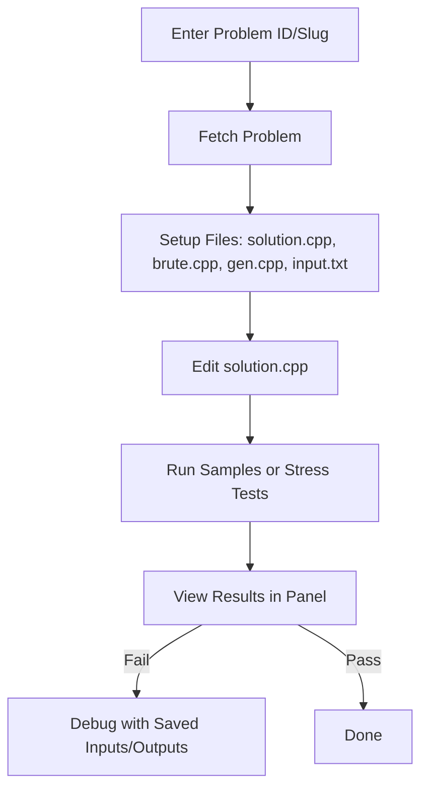
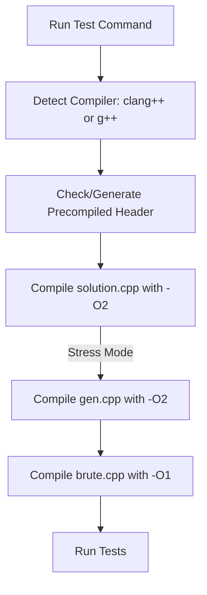

# LeetCode Stress Tester

[](https://marketplace.visualstudio.com/VSCode) [](LICENSE) [](https://nodejs.org)

A powerful Visual Studio Code extension designed for competitive programmers to streamline LeetCode problem-solving. Fetch problems, set up local C++ testing environments, run sample tests, and perform stress testing with random inputs—all from within your editor. This tool emphasizes speed, cross-platform compatibility, and ease of use.

 <!-- Placeholder: Add a screenshot of the extension panel -->

---

## 🚀 Features

- **Problem Fetching:** Instantly fetch LeetCode problems by ID or slug, including samples, code snippets, and official solutions.
- **Automated Setup:** Creates a dedicated `stress tester/` directory with templated C++ files (`solution.cpp`, `brute.cpp`, `gen.cpp`) and input/output handlers.
- **Sample Testing:** Run your solution against LeetCode sample cases with parallel execution for speed.
- **Stress Testing:** Generate random test cases via `gen.cpp`, compare your solution against a brute-force implementation, and detect discrepancies.
- **Visual Interface:** Interactive panel with real-time progress, logs, pass/fail indicators, and detailed failure reports.
- **Customization:** Easily modify `gen.cpp` for tailored random inputs; configure test count and timeouts via VS Code settings.
- **Cross-Platform:** Works seamlessly on Windows, macOS, and Linux with automatic compiler detection (g++ or clang++).
- **Debugging Aids:** Saves all inputs/outputs for failed tests; uses precompiled headers for faster builds.

---

## 🏛️ Architecture Overview

Below is a high-level architecture diagram of the LeetCode Stress Tester extension. It shows how the components interact to fetch problems, compile code, and run tests.

```mermaid
graph TD
    subgraph "VS Code Extension"
        A[Extension Activation] --> B[PanelProvider]
        B --> C[Webview Panel UI]
        C -->|User Input| D[Commands: Fetch, Run Samples, Run Stress]
    end
    subgraph "Node.js Backend (src/utils/)"
        D --> E[stressRunner.js: Handle Commands]
        E --> F[fetch.js: LeetCode GraphQL API]
        E --> G[parseProblem.js: Extract Samples]
        E --> H[canonicalTemplate.js: Generate Templates]
        E --> I[Compile Sources: Detect Compiler, Generate PCH, Compile CPP Files]
        I --> J[Run Test Workers: Parallel Execution]
    end
    subgraph "File System (stress tester/)"
        F --> K[Create Files: solution.cpp, brute.cpp, gen.cpp]
        G --> L[textIO/input.txt: Samples]
        I --> M[Executables: solution.exe, brute.exe, gen.exe]
        J --> N[Outputs: all_input.txt, solution_output.txt, brute_output.txt]
    end
    subgraph "External Dependencies"
        F --> O[LeetCode API]
        I --> P[C++ Compiler (g++ or clang++)]
    end
    J -->|Results| C[Update UI with Logs/Progress]
    style A fill:#f9f,stroke:#333
    style O fill:#bbf,stroke:#333
    style P fill:#bbf,stroke:#333
```

This diagram is rendered interactively on GitHub. For a static image, you can export it from Mermaid Live Editor.

---

## 🛠️ Installation

### Prerequisites
- VS Code 1.60+.
- A C++ compiler (g++ or clang++) installed and in your PATH.
- Node.js and npm for packaging.

### Steps
1. **Clone the Repository:**
   ```sh
   git clone https://github.com/yourusername/leetcode-stress-tester.git
   cd leetcode-stress-tester
   ```

2. **Install Dependencies:**
   ```sh
   npm install
   ```

3. **Package the Extension:**
   - Install `vsce` globally:
     ```sh
     npm install -g vsce
     ```
   - Package:
     ```sh
     vsce package
     ```
   - This generates a `.vsix` file.

4. **Install in VS Code:**
   - Open VS Code.
   - Go to Extensions view (`Ctrl+Shift+X`).
   - Click the `...` menu and select `Install from VSIX...`.
   - Choose the `.vsix` file.

5. **Verify:** Reload VS Code and look for the "Stress Tester" icon in the activity bar.

---

## 🧑‍💻 Usage

### 1. Open the Panel
- Click the beaker icon in the VS Code activity bar to open the "Stress Tester" panel.

 <!-- Existing icon -->
 <!-- Placeholder: Replace with screenshot of the full UI panel -->

### 2. Fetch a Problem
- Enter a LeetCode problem ID (e.g., "1") or slug (e.g., "two-sum") in the input field.
- Click **📥 Fetch Problem**.
- This:
  - Downloads problem data via LeetCode GraphQL API.
  - Sets up `stress tester/` directory with files.
  - Extracts samples into `textIO/input.txt` (editable format: input --- output).
  - Fetches official or GitHub brute-force solution into `brute.cpp`.
  - Generates `solution.cpp` with LeetCode C++ snippet inserted into a canonical template.

### 3. Implement Your Solution
- Open `stress tester/solution.cpp`.
- Write your code inside the provided class/method (uses JSON parsing for inputs).
- The template handles input/output automatically.

 <!-- Placeholder: Replace with screenshot of input.txt file open in VS Code -->

### 4. Run Tests
- **🧪 Run Samples:** Tests against samples in `textIO/input.txt`. Runs in parallel (up to 4-16 workers based on CPU).

 <!-- Placeholder: Replace with screenshot of sample test success in UI -->
 <!-- Placeholder: Replace with screenshot of sample test failure in UI -->

- **⚡ Run Stress Tests:** Generates random cases via `gen.cpp`, runs `solution.cpp` and `brute.cpp`, compares outputs.
  - Configurable: Set `leetcodeStressTester.testCount` (default: 100) and `timeLimitMs` (default: 2000ms) in VS Code settings.

 <!-- Placeholder: Replace with screenshot of stress test success in UI -->
 <!-- Placeholder: Replace with screenshot of stress test failure in UI -->

Results appear in the panel with logs, progress bars, and failure details.

### Workflow Diagram



---

## 🏗️ Build Process

The extension handles compilation automatically when running tests. Here's a detailed breakdown:

### Compiler Detection
- Checks for `clang++` first, falls back to `g++`.
- Throws an error if neither is found.

### Precompiled Headers
- Created in `stress tester/pch/` if not present.
- Content: `#include <bits/stdc++.h>`
- Command: `${compiler} -std=c++17 "stdc++.h" -o "stdc++.h.gch"`
- Used via `-include stdc++.h` flag for faster compiles.
- Generated only once; delete `stdc++.h.gch` to regenerate.

### Compilation Flags
- **solution.cpp:** `-std=c++17 -O2 -pipe -march=native -DNDEBUG -include <pch>`
- **brute.cpp:** `-std=c++17 -O1 -pipe -DNDEBUG -include <pch>` (simpler optimization for brute force)
- **gen.cpp:** `-std=c++17 -O2 -pipe -DNDEBUG -include <pch>`
- On clang++: Adjusts for compatibility (e.g., `-flto=thin`).

### Steps
1. Detect compiler.
2. Generate/check precompiled header.
3. Compile each file if needed (always recompiles for safety).
4. Use `spawnSync` to run compilation commands.
5. On Windows, appends `.exe` to executables.

Compilation happens before tests and takes ~1-2 seconds with precompiled headers.

### Build Diagram



---

## 🔧 Customizing gen.cpp

`gen.cpp` generates random test cases for stress testing. It's crucial for finding edge cases.

### Default Behavior
- Generates random inputs (e.g., arrays, numbers) based on problem constraints.
- Uses `<random>` for randomness.
- Outputs in JSON-per-line format (e.g., `[1,2,3]\n5`).

### Customization Tips
- **Understand Inputs:** Refer to the problem for required format (e.g., array + target).
- **Add Constraints:** Use random_device for seeds; generate within limits (e.g., 1 <= n <= 1e5).
- **Example Modification:**
  ```cpp
  // In main():
  mt19937 rng(random_device{}());
  int n = uniform_int_distribution<int>(1, 1000)(rng);
  cout << n << endl;
  for(int i = 0; i < n; i++) cout << uniform_int_distribution<int>(-100, 100)(rng) << ' ';
  cout << endl;
  ```
- **Minute Details:** Ensure outputs match the expected input format for `solution.cpp` and `brute.cpp`. Use `json.hpp` if needed for complex structures.
- **Best Practices:** Start small, increase complexity; test gen.cpp independently by compiling and running it.

 <!-- Placeholder: Replace with screenshot of gen.cpp in action or open in editor -->

---

## 📁 Directory Structure

After fetching a problem:

```
Leetcode-Stress-Tester/
├── stress tester/
│   ├── solution.cpp     # Your solution code
│   ├── brute.cpp        # Brute-force/official solution
│   ├── gen.cpp          # Random test generator
│   ├── pch/             # Precompiled headers
│   │   ├── stdc++.h
│   │   └── stdc++.h.gch
│   ├── textIO/
│   │   ├── input.txt    # Editable samples (input --- output)
│   │   ├── all_input.txt # Stress inputs
│   │   ├── solution_output.txt
│   │   └── brute_output.txt
│   └── utils/
│       ├── json.hpp     # JSON parser
│       └── template.cpp # Canonical template
└── ... (other project files)
```

---

## ⚙️ Configuration

Customize via VS Code settings (`Ctrl+,`):
- `leetcodeStressTester.testCount`: Number of stress tests (default: 100).
- `leetcodeStressTester.timeLimitMs`: Per-test timeout (default: 2000ms).

---

## 🐛 Troubleshooting

- **Compiler Not Found:** Ensure g++ or clang++ is in PATH.
- **Compilation Errors:** Check logs in the panel; fix syntax in .cpp files.
- **No Samples:** Edit `textIO/input.txt` manually.
- **Spaces in Paths:** Handled automatically in latest version.
- **Slow Builds:** Precompiled headers should help; delete `pch/` to regenerate.

For issues, check the VS Code output panel ("LeetCode Stress Tester").

---

## 🤝 Contributing

Contributions welcome! Fork the repo, make changes, and submit a PR.
- Report bugs in Issues.
- Suggest features or improvements.

---

## 📄 License

MIT License. See [LICENSE](LICENSE) for details.

Happy Coding! 🚀
