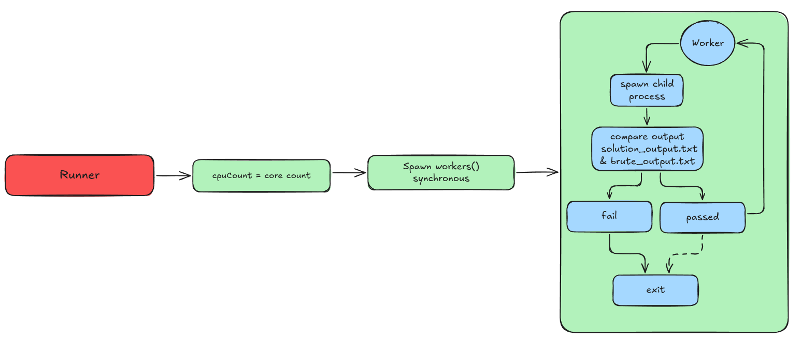

# LeetCode Stress Tester

  

[](https://marketplace.visualstudio.com/VSCode)

A Visual Studio Code extension for programmers to fetch LeetCode problems, set up local C++ testing environments, and stress-test your solutions with random and sample test cases—all from within your editor.
   [demovid.mp4](https://www.youtube.com/watch?v=Ungx2Uj25b8&feature=youtu.be)
  
  
  
 
---

## Features

-  **Problem Fetching:** Instantly fetch LeetCode problems by ID or title, including samples, code snippets, and official solutions.

-  **Automated Setup:** Creates a dedicated `stress tester/` directory with  C++ files (`solution.cpp`, `brute.cpp`, `gen.cpp`) and input/output handlers.

-  **Sample Testing:** Run your solution against LeetCode sample cases with parallel execution for speed.

-  **Stress Testing:** Generate random test cases via `gen.cpp`, compare your solution against a brute-force implementation, and detect discrepancies.

-  **Visual Interface:** Interactive panel with real-time progress, logs, pass/fail indicators, and detailed failure reports.

-  **Customization:** Easily modify `gen.cpp` for tailored random inputs; configure test count and timeouts via VS Code settings.

-  **Cross-Platform:** Works seamlessly on Windows and Linux with automatic compiler detection (g++).

-  **Debugging Aids:** Saves all inputs/outputs for failed tests; uses precompiled headers for faster builds.
---

  

## 🏛️ Project Flow

Below is a architecture diagram of the LeetCode Stress Tester extension. It shows how the components interact to fetch problems, compile code, and run tests.

  
  

---

## 🛠️ Installation

### Prerequisites
 - Open VS Code.
- C++ compiler
- Node.js and npm for packaging

### Steps

1.  **Clone the Repository:**

```sh

git clone https://github.com/ShubhamNegi4/Leetcode-Stress-Tester.git

cd leetcode-stress-tester

```
2.  **Install Dependencies:**

```sh

npm install

```

3.  **Package the Extension:**

- Install `vsce` globally:

```sh

npm install -g vsce

```

- Package:

```sh

vsce package

```

- This generates a `.vsix` file.

  

4.  **Install in VS Code:**

	- Open VS Code.

	- Go to Extensions view (`Ctrl+Shift+X`).

	- Click the `...` menu and select `Install from VSIX...`.

	- Choose the `.vsix` file.

5.  **Verify:** Reload VS Code and look for the "Stress Tester" icon in the activity bar.
---

  
## 🧑‍💻 Usage

### 1. Open the Panel

- Click the beaker icon in the VS Code activity bar to open the "Stress Tester" panel.

### 2. Fetch a Problem

- Enter a LeetCode problem ID (e.g., "1") or slug (e.g., "two-sum") in the input field.

- Click **Fetch Problem**.

	- Downloads problem data via LeetCode GraphQL API.

	- Sets up `stress tester/` directory with files.

	- Extracts samples into `textIO/input.txt` (editable format: input --- output).

	- Fetches official or GitHub brute-force solution into `brute.cpp`.

	- Generates `solution.cpp` with LeetCode C++ snippet inserted into a canonical template.

  

### 3. Implement Your Solution

- Open `stress tester/solution.cpp`.

- Write your code inside the provided class/method.

- The template handles input/output automatically.

### 4. Run Tests

-  ** Run Samples:** Tests against samples in `textIO/input.txt`. Runs in parallel (up to 4-16 workers based on CPU).
  

-  ** Run Stress Tests:** Generates random cases via `gen.cpp`, runs `solution.cpp` and `brute.cpp`, compares outputs.

- Configurable: Set `leetcodeStressTester.testCount` (default: 100) and `timeLimitMs` (default: 2000ms) in VS Code settings.

Results appear in the panel with logs, progress bars, and failure details.

## 🏗️ Build Process

  

The extension handles compilation automatically when running tests. Here's a detailed breakdown:
  

### Precompiled Headers

- Created in `stress tester/pch/` if not present.

- Content: `#include <bits/stdc++.h>`

- Command: `${compiler} -std=c++17 "stdc++.h" -o "stdc++.h.gch"`

- Used via `-include stdc++.h` flag for faster compiles.

- Generated only once; delete `stdc++.h.gch` to regenerate.

  

### Compilation Flags
	Note: If error encountered, please update your gcc (recommended: 13.x.x)

-  **solution.cpp:**  `-std=c++17 -O2 -pipe -march=native -DNDEBUG -include <pch>`

-  **brute.cpp:**  `-std=c++17 -O1 -pipe -DNDEBUG -include <pch>` (simpler optimization for brute force)

-  **gen.cpp:**  `-std=c++17 -O2 -pipe -DNDEBUG -include <pch>`

### Steps

1. Detect compiler.

2. Generate/check precompiled header.

3. Compile each file if needed (always recompiles for safety).

4. Use `spawnSync` to run compilation commands.

5. On Windows, appends `.exe` to executables.

  

Compilation happens before tests and takes ~1-2 seconds with precompiled headers.

  

## 🔧 Customizing gen.cpp


`gen.cpp` generates random test cases for stress testing. It's crucial for finding edge cases.


### Default Behavior

- Generates random inputs (e.g., arrays, numbers) based on problem constraints.

- Uses `<random>` for randomness.

- Outputs in JSON-per-line format (e.g., `[1,2,3]\n5`).

  

### Customization Tips

-  **Understand Inputs:** Refer to the problem for required format (e.g., array + target).

-  **Add Constraints:** Use random_device for seeds; generate within limits (e.g., 1 <= n <= 1e5).

-  **Example Modification:**

```cpp

// In main():

mt19937  rng(random_device{}());

int n = uniform_int_distribution<int>(1, 1000)(rng);

cout << n << endl;

for(int i = 0; i < n; i++) cout << uniform_int_distribution<int>(-100, 100)(rng) << ' ';

cout << endl;

```

-  **Minute Details:** Ensure outputs match the expected input format for `solution.cpp` and `brute.cpp`. Use `json.hpp` if needed for complex structures.

-  **Best Practices:** Start small, increase complexity; test gen.cpp independently by compiling and running it.

---

  

## 📁 Directory Structure

After fetching a problem:
```

Leetcode-Stress-Tester/

├── stress tester/

│ ├── solution.cpp # Your solution code

│ ├── brute.cpp # Brute-force/official solution

│ ├── gen.cpp # Random test generator

│ ├── pch/ # Precompiled headers

│ │ ├── stdc++.h

│ │ └── stdc++.h.gch

│ ├── textIO/

│ │ ├── input.txt # Editable samples (input --- output)

│ │ ├── all_input.txt # Stress inputs

│ │ ├── solution_output.txt

│ │ └── brute_output.txt

│ └── utils/

│ ├── json.hpp # JSON parser

│ └── template.cpp # Canonical template

└── ... (other project files)

```
---

  

## ⚙️ Configuration

Customize via VS Code settings (`Ctrl+,`):

-  `leetcodeStressTester.testCount`: Number of stress tests (default: 100).

-  `leetcodeStressTester.timeLimitMs`: Per-test timeout (default: 2000ms).
---


## 🐛 Troubleshooting


-  **Compiler Not Found:** Please upgrade gcc ( recommended 13.x.x or more )

-  **Compilation Errors:** Check logs in the panel; fix syntax in .cpp files.

-  **No Samples:** Edit `textIO/input.txt` manually.

-  **Spaces in Paths:** Handled automatically in latest version.

-  **Slow Builds:** Precompiled headers should help; delete `pch/` to regenerate.


For issues, check the VS Code output panel ("LeetCode Stress Tester").

---

## 🤝 Contributing

Contributions welcome! Fork the repo, make changes, and submit a PR.

- Report bugs in Issues.

- Suggest features or improvements.

---